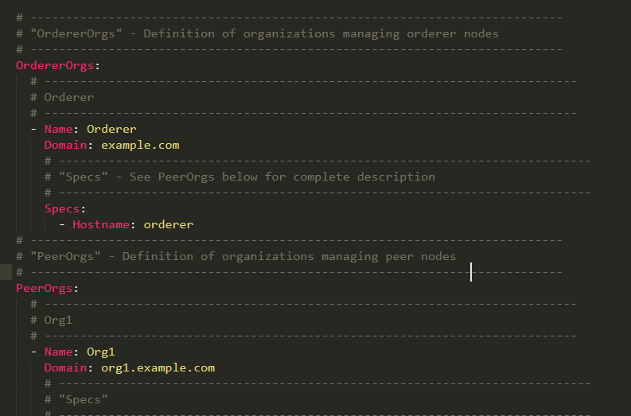
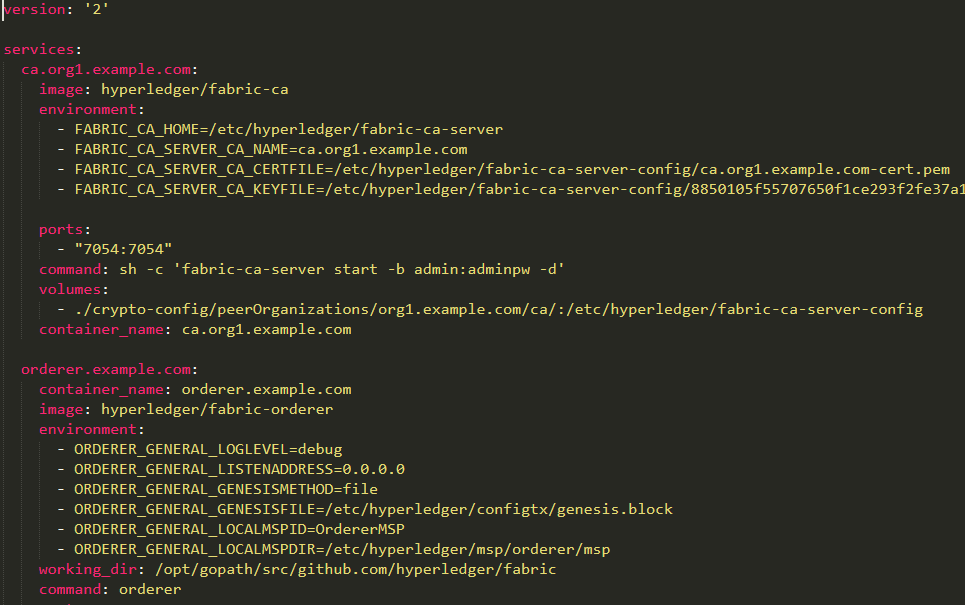
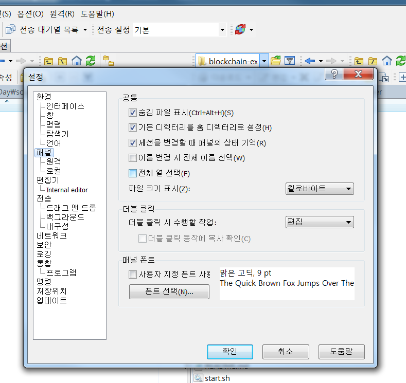
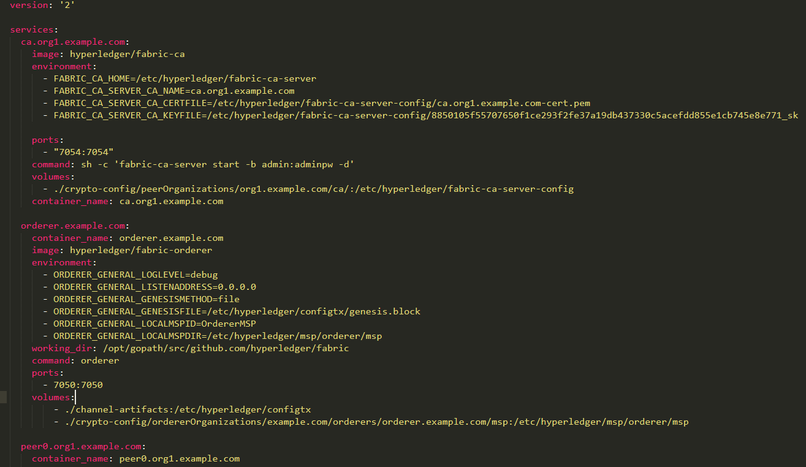

# IBM Blockchain Experience Day  
  
  
## 실습1 : Hyperledger Fabric 시작하기  
********
  
## 실습 목표
본 실습은 Hyperledger Fabric 을 이용하여 블록체인 네트워크 환경을 구성하고 샘플 네트워크를 동작시키는 과정을 단계별로 알아봅니다. Hyperledger Fabric은 Linux Foundation산하의 open source 프로젝트로서 분산 원장 기술을 전 산업에 걸쳐 표준화하고 발전시키려는 목적으로 개발되고 있습니다.  


## 사전 준비사항  
본 실습은 Linux OS 중의 하나인 Ubuntu에서 Docker Container 기반으로 진행됩니다. 실습을 위해서는 다음과 같은 환경의 준비가 필요합니다.  
* 물리적 혹은 가상화된 서버
* 2 Core 이상의 CPU
* 8GB 이상의 Memory
* 64GB 이상의 Disk 용량

  
## 기본 환경 구성
본 실습을 위해서는 다음과 같은 소프트웨어가 사전에 설치되어야 합니다.  
* Node.js (v8.9.4)
* npm (v5.6.0)
* Docker (v17.12.0-ce)
* Docker Compose (v1.13.0)
* Python (v2.7.12)  


괄호 안의 버전은 본 실습이 테스트 된 환경입니다. 그 외 다른 버전으로도 가능할 수 있으나 원활한 실습을 위해서 해당 버전을 인스톨 하는 것을 권장합니다.  
원격 접속 터미널 도구(Putty) 를 통해 제공된 리눅스 서버에 접속하여 아래의 명령을 실행하도록 하겠습니다.  
아래와 같이 curl을 통해 스크립트를 다운로드하고 실행하면 필요한 소프트웨어를 한번에 설치합니다.  
  
```
cd ~
sudo apt-get update
curl -O https://hyperledger.github.io/composer/latest/prereqs-ubuntu.sh
chmod u+x prereqs-ubuntu.sh
./prereqs-ubuntu.sh
```
  
추가로 docker-compose를 설치합니다.
```
sudo apt-get install docker-compose
```
  
**설치가 완료되면 터미널을 닫고 다시 로그인합니다.**  


## Hyperledger Fabric 설치  
본 실습에서는 Hyperledger Fabric 1.0.6 버전을 이용합니다. 1.0.6 버전은 Hyperledger Fabric 1.1 버전 이전의 마지막 release로서 교재 작성일 현재 최신의 안정화된 버전입니다.  
  
다음의 명령을 통하여 Hyperledger Fabric 1.0.6 바이너리와 Docker 이미지들을 다운로드합니다.  
```
mkdir fabric-binaries
cd fabric-binaries
curl -sSL https://goo.gl/6wtTN5 | bash -s 1.0.6
```
  
Hyperledger Fabric 명령을 보다 간편하게 수행하기 위해서 .profile 파일에 다운로드한 binary 폴더를 PATH로 추가합니다. 우선 vi 에디터로 .profile 파일을 오픈합니다.  
```
cd ~
sudo vi .profile
```
  
.profile 파일의 가장 끝에 아래와 같은 코드를 추가합니다.  
```
export PATH=~/fabric-binaries/fabric-samples/bin:$PATH
```
  
> vi 에디터를 편집하기 위해서는 'i' 키를 입력합니다.  
> vi 에디터에서 편집된 데이터를 저장하고 나가려면 esc키를 누르고 'wq'를 입력합니다.
  
변경사항을 적용하기 위하여 다음의 명령을 수행합니다.  
```
source .profile
```
  
이제 Hyperledger Fabric을 시작하기 위한 구성파일을 준비합니다. 우선 홈디렉토리 하위에 blockchain-demo 디렉토리를 생성합니다. 그리고 그 하위에 local-hyperledger 폴더를 생성합니다. *(본 실습 환경에서는 이미 디렉토리가 생성되어 있습니다.)*  
```
mkdir blockchain-demo
cd blockchain-demo
mkdir local-hyperledger
```
Lab01 교재와 같은 폴더에 들어있는 local-hyperledger.zip 파일의 압축을 풀어 포함된 파일들을 local-hyperledger 폴더에 복사합니다. *(본 실습 환경에서는 이미 파일들이 복사되어 있습니다.)*  
압축파일에 포함된 파일들은 아래와 같습니다.  
* channel-artifacts (디렉토리)
* crypto-config (디렉토리)
* configtx.yaml
* crypto-config.yaml
* docker-compose.yaml


local-hyperledger 폴더에 포함된 파일들을 살펴봅니다.  
configtx.yaml 파일은 블록체인 네트워크의 채널과 조직에 관련된 설정을 담고 있습니다.  
  
  

crypto-config.yaml 파일은 Orderer와 Peer의 사용자 인증서를 생성하기 위한 설정 파일입니다.  
  
  

마지막으로 docker-compose.yml 파일은 Docker Compose를 이용하여 여러 컨테이너를 동시에 관리하기 위해 사용되는 설정파일로 peer, orderer, ca 등의 컴포넌트들이 컨테이너로 기동되어 블록체인 네트워크를 구성할 수 있도록 정의합니다.  
  
  

## Hyperledger Fabric 구동을 위한 artifact 생성  
Hyperledger Fabric을 구성하기 위해서는 관련된 artifact들을 먼저 생성해야 합니다.  

우선 블록체인 네트워크에서 사용되는 관리자와 사용자의 인증서를 생성하도록 하겠습니다. 인증서 생성에 필요한 설정은 crypto-config.yaml 파일에 정의되어 있습니다. 앞서 바이너리로 다운받은 bin 폴더 내의 cryptogen 명령어를 실행시켜 인증서를 생성합니다. 이미 path를 설정하였으므로 경로를 명시하지 않고 명령을 실행할 수 있습니다.  
```
cd ~/blockchain-demo/local-hyperledger
cryptogen generate --config=./crypto-config.yaml
```
본 실습에서는 1개의 조직만으로 네트워크를 구성하고 있으므로 org1에 대한 인증서만이 생성됩니다. 생성된 인증서는 현재 디렉토리 하위의 crypto-config라는 폴더에 저장됩니다.  
   
다음은 최초에 생성되는 블록인 genesis 블록과 channel 관련 정보를 생성합니다. configtxgen 명령은 블록체인 시작에 필요한 artifact들을 생성하는 명령입니다. 이 명령은 configtx.yaml 파일에 설정된 채널과 조직에 기반하여 artifact들을 생성합니다.  
  
  
configtx.yaml 파일이 현재의 경로에 있으므로 해당 경로를 FABRIC_CFG_PATH에 설정한 후 genesis 블록을 생성합니다. 여기서 생성되는 블록 파일은 블록체인에서 최초 블록의 역할을 하게 됩니다.

```
export FABRIC_CFG_PATH=$PWD
configtxgen -profile ComposerOrdererGenesis -outputBlock ./channel-artifacts/genesis.block
```

생성된 파일은 현재 디렉토리 하위의 channel-artifacts폴더에 저장됩니다.  
다음은 아래의 명령으로 채널 구성에 필요한 artifact를 생성합니다.  
```
$ export CHANNEL_NAME=composerchannel
$ configtxgen -profile ComposerChannel -outputCreateChannelTx ./channel-artifacts/composer-channel.tx -channelID $CHANNEL_NAME
```
  
위 명령은 채널 이름을 composerchannel로 하고channel-artifacts 폴더 내에 composer-channel.tx라는 이름으로 채널 configuration 파일을 생성합니다. 여기에 이용되는 ComposerChannel 프로파일은 configtx.yaml에 정의되어 있습니다.  
향후 채널 내에서 발생할 transaction의 전파 기준이 될 Anchor peer를 정의합니다. Anchor peer는 peer간의 통신에서 메시지를 중계해주는 peer의 역할을 하게 될 것입니다.  
```
$ configtxgen -profile ComposerChannel -outputAnchorPeersUpdate ./channel-artifacts/Org1MSPanchors.tx -channelID $CHANNEL_NAME -asOrg Org1
```
  
## Hyperledger Fabric 네트워크 시작
docker-compose를 이용하면 필요한 모든 컨테이너들을 한번에 실행할 수 있습니다. docker-compose를 실행하기 위한 모든 설정은 docker-compose.yml에 정의되어 있습니다. 우선 에디터를 열어 docker-compose.yml 파일을 자신의 환경에 맞게 편집해야 합니다. 여기서는 CA (Certificate Authority)에서 사용하는 key file의 경로만 수정하면 되도록 구성하였습니다.  
WinSCP를 이용해 서버의 ~/blockchain-demo/local-hyperledger 경로에 위치한 docker-compose.yml을 다운받은 후에 편집기(Atom)에서 오픈합니다.  

#### WinSCP 설정 팁
> WinSCP의 기본 설정은 .으로 시작하는 디렉토리가 보이지 않습니다. 차후 실습을 위해 이를 보이게 하는 설정을 하는것이 좋습니다.  
> 옵션 > 설정 > 좌측탭의 패널 > 숨김 파일 표시에 체크를 하면 됩니다.  

  
파일 상단의 services 하위 ca.org1.example.com 하위의 environment 설정에서 FABRIC_CA_SERVER_CA_KEYFILE 의 값을 수정합니다. 맨 끝에 xxx_sk 라고 되어 있는 파일명을 다음의 경로에 존재하는 파일명으로 변경합니다.  
*파일경로: ~/blockchain-demo/local-hyperledger/crypto-config/peerOrganizations/org1.example.com/ca*  

다음의 ls 명령으로 해당 디렉토리에 존재하는 파일명을 조회할 수 있습니다.  
```
ls ~/blockchain-demo/local-hyperledger/crypto-config/peerOrganizations/org1.example.com/ca
```
  
> WinSCP에서 파일명을 복사하는 것이 더 편리할 수도 있습니다.  
  
  
변경이 되었다면 저장한 후 다시 서버의 같은 위치로 전송합니다.  
  
이제 준비가 되었다면 docker-compose를 이용하여 Hyperledger Fabric네트워크를 구동합니다.  
```
cd ~/blockchain-demo/local-hyperledger
docker network create composer_default
docker-compose up -d
```

정상적으로 수행이 되었다면 docker ps 명령으로 다음과 같은 docker 컨테이너들을 볼 수 있습니다.  
```
docker ps
```
 
본 실습의 Hyperledger Fabric 네트워크 구성은 peer 두개, ca, orderer로 이루어져 있고 각 peer는 world state를 저장하기 위한 데이터베이스로 couch db를 사용하고 있습니다.  

그리고fabric-tools cli 컨테이너에서는 각 노드에 접근하여 Hyperledger Fabric 명령을 수행할 수 있습니다. 마지막으로 composer-playground는 이후 lab에서 사용하게될 웹 기반 비즈니스 네트워크 모델링 인터페이스를 제공하게 될 컨테이너로 현재는 보이지 않을 것입니다.  

docker exec 명령을 통해 fabric-tools의 cli 컨테이너로 접근하여 Hyperledger Fabric블록체인 네트워크에 명령을 수행할 수 있습니다.  
```
docker exec -it cli bash
```
 

아래와 같이 composerchannel이라는 이름의 채널을 생성합니다. 채널 생성 명령은 orderer전달되고 orderer에서 각 peer들이 join할 수 있는 채널이 생성되게 됩니다. 여기서는 이전에 생성하였던 channel artifact인 composer-channel.tx 파일이 이용됩니다.  
```
CHANNEL_NAME=composerchannel
peer channel create -o orderer.example.com:7050 -c $CHANNEL_NAME -f ./channel-artifacts/composer-channel.tx
```

채널 이름은 앞서 채널 configuration artifact를 생성할 때 주었던 이름과 동일해야 합니다. 채널이 생성되면 해당 채널의 이름으로 블럭이 하나 생성됩니다.  

 

채널이 성공적으로 생성되었다면 각 peer를 채널에 조인합니다. 이때 특정 peer에 대한 명령을 수행하기 위해서는 CORE_PEER_ADDRESS를 명령 수행 전에 설정해야 합니다.  
```
CORE_PEER_ADDRESS=peer0.org1.example.com:7051
peer channel join -b composerchannel.block
```
```
CORE_PEER_ADDRESS=peer1.org1.example.com:7051
peer channel join -b composerchannel.block
```
구성된 채널에 대해 anchor peer를 업데이트합니다.
```
CORE_PEER_ADDRESS=peer0.org1.example.com:7051
peer channel update -o orderer.example.com:7050 -c $CHANNEL_NAME -f ./channel-artifacts/Org1MSPanchors.tx
```
  
## Chaincode 테스트  
Hyperledger Fabric 블록체인 네트워크에서 데이터를 쓰거나 읽기 위해서는 chaincode가 정의되어 있어야 합니다. 현재 버전에서 체인코드는 Golang과 Node.js 둘 중 하나의 언어를 선택하여 적용할 수 있습니다. 본 실습에서는 Golang을 이용하도록 하겠습니다.  

여기서는 Hyperledger Fabric에서 기본적으로 제공하는 샘플 체인코드를 사용하여 체인코드의 수행을 테스트합니다. 사용할 샘플 체인코드는 제공된 Linux 서버의 ~/blockchain-demo/chaincode/chaincode_example02 폴더에 위치해 있습니다. 그리고 이 파일의 경로는 cli 컨테이너가 구동될 때 바인딩이 되어 있어 cli 컨테이너 내에서는 github.com/hyperledger/fabric/examples/chaincode/go/chaincode_example02 경로에서 찾을 수 있습니다.  
본 샘플 체인코드는 간단하게 자산의 이동을 표현하는 비즈니스 로직을 담고 있는데 A와 B 두 사용자 간에서 주어진 금액을 이동시킵니다.  

우선 체인코드를 각 peer에 install해야 합니다. 아래의 명령은 두 개의 peer에 각각 체인코드를 설치하는 명령입니다.  
```
CORE_PEER_ADDRESS=peer0.org1.example.com:7051
peer chaincode install -n mycc -v 1.0 -p github.com/hyperledger/fabric/examples/chaincode/go/chaincode_example02
```
```
CORE_PEER_ADDRESS=peer1.org1.example.com:7051
peer chaincode install -n mycc -v 1.0 -p github.com/hyperledger/fabric/examples/chaincode/go/chaincode_example02
```
그리고 아래의 instantiate명령으로 체인코드를 시작합니다.  
```
CORE_PEER_ADDRESS=peer0.org1.example.com:7051
peer chaincode instantiate -o orderer.example.com:7050 -C $CHANNEL_NAME -n mycc -v 1.0 -c '{"Args":["init","a", "100", "b","200"]}'
```
체인코드를 instantiate 하면서 초기값으로 a에는 100을 b에는 200을 세팅합니다. instantiate 명령을 수행하게 되면 각 peer에 인스톨되어 있던 체인코드가 별도의 docker 컨테이너 형태로 생성되어 구동됩니다.  
  
모든 데이터는 체인코드를 통해서 블록체인 네트워크에 전달되고 조회됩니다. 이제 query 명령으로 블록체인 네트워크에 저장된 값을 조회해 보도록 하겠습니다.  
```
peer chaincode query -C $CHANNEL_NAME -n mycc -c '{"Args":["query","a"]}'
```
초기에 세팅한 값인 100이 조회될 것입니다.  

아래의 invoke 명령을 통하여 10만큼을 a에서 b로 이동시켜 보겠습니다.  
```
peer chaincode invoke -o orderer.example.com:7050 -C $CHANNEL_NAME -n mycc -c '{"Args":["invoke","a","b","10"]}'
```

다시 a의 값을 조회해 보겠습니다.  
```
peer chaincode query -C $CHANNEL_NAME -n mycc -c '{"Args":["query","a"]}'
```
초기의 100에서 10이 b에게 전달되어 90의 값이 조회될 것입니다.  

exit로 컨테이너를 빠져나옵니다.  
```
exit
```

## Hyperledger Fabric 네트워크 중지 및 초기화  
본 실습에서 Hyperledger Fabric 네트워크를 docker 기반의 컨테이너로 동작시켰으므로 컨테이너를 정지시키고 삭제함으로써 네트워크를 중지하고 초기화할 수 있습니다. docker-compose up으로 실행시킨 컨테이너들은 docker-compose down 명령을 통해 일괄적으로 컨테이너를 중지하고 삭제할 수 있습니다.  
***(다음 실습을 위해서 아래 명령은 실행하지 마세요.)***
```
docker-compose down
```

실습 01을 완료하셨습니다. 수고하셨습니다.  


